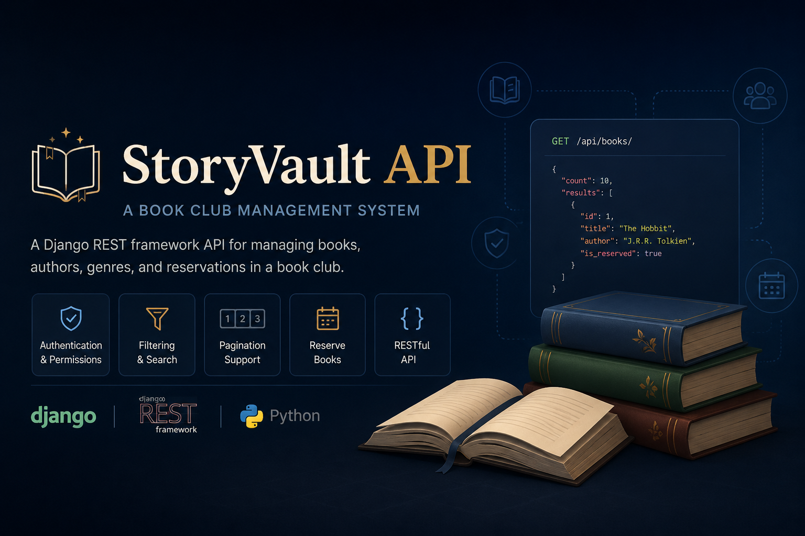
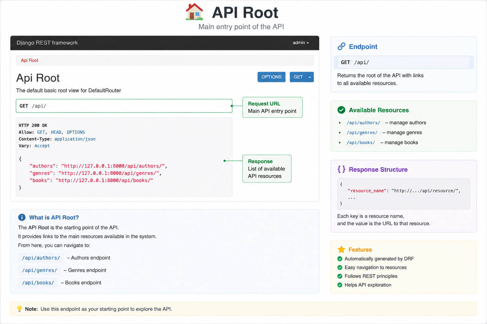
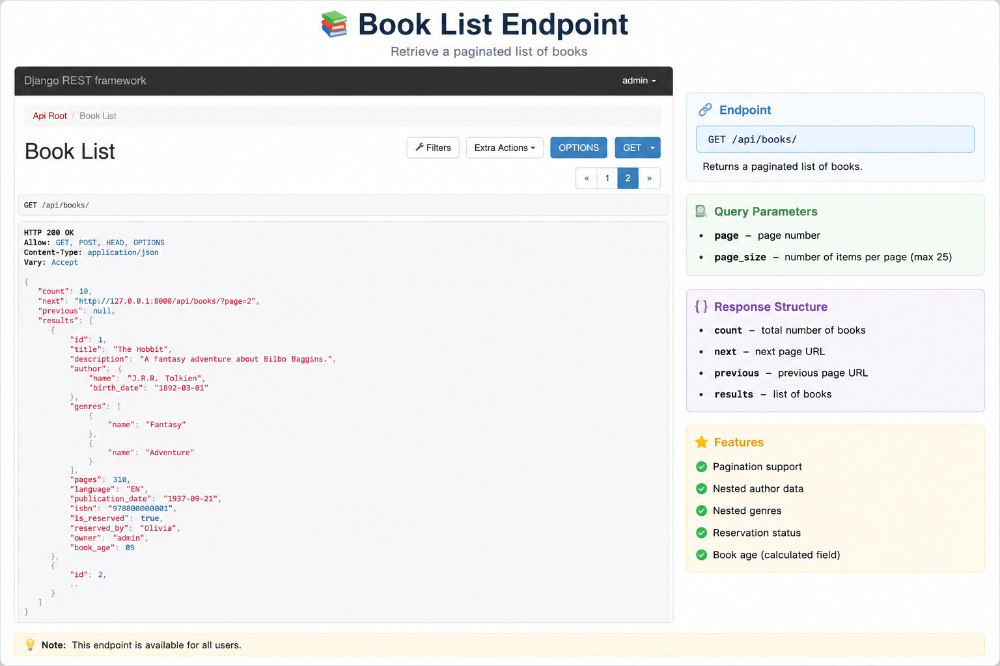
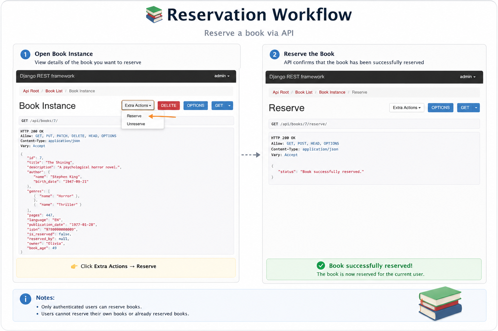
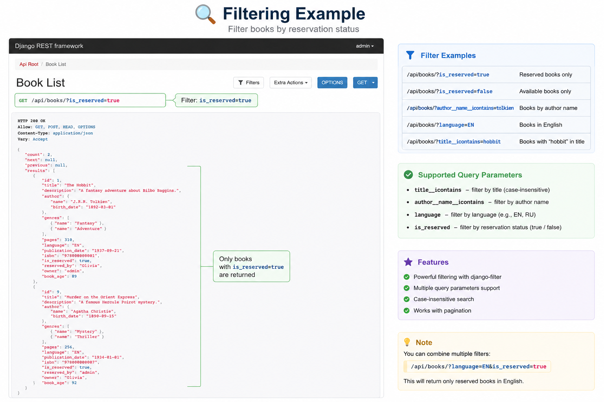
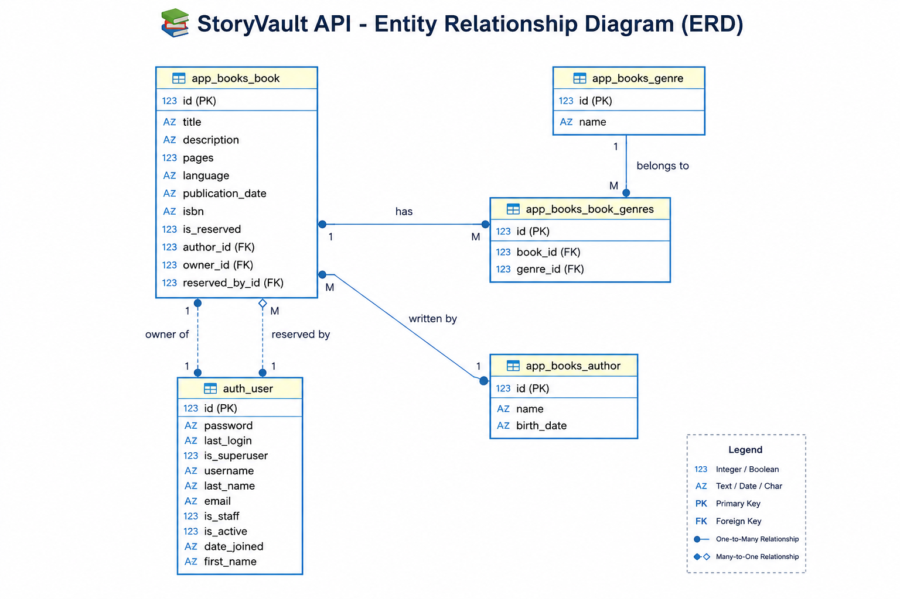

**StoryVault API** - a REST API for a book-sharing club where users can add books, browse collections, reserve books from other members, and manage their own library.

Built with Django REST Framework.

---

## 🛠️ Tech Stack


---

## 🧰 Development Tools

- DBeaver (database inspection and ERD generation)
- Django REST Framework Browsable API (API testing and exploration)
- Black (code formatting)
- isort (import sorting)

---

## ✨ Features

### 👤 User Management
* Authentication with Session Authentication and Basic Authentication
* Superuser support through Django Admin
* Ownership-based permissions



### 📚 Books
* Create, update, and delete your own books
* Browse all available books
* View detailed information about a book
* Automatic owner assignment



### 🏷️ Genres & Authors
* Manage authors
* Manage genres
* Connect books with authors and genres

### 🔒 Reservation System
* Reserve books from other users
* Cancel your reservation
* Prevent users from reserving their own books
* Prevent double reservations



### 🔎 Filtering
Filter books by:
* Title
* Author name
* Language
* Reservation status



### 📄 Pagination

Books are paginated:
```
/api/books/?page=2
```
Custom page size:
```
/api/books/?page_size=5
```
Maximum page size:
```
25
```

### ⚡ Custom Endpoints

Get books published within the last 100 years:
```
GET /api/books/recent_books/
```
Reserve a book:
```
POST /api/books/{id}/reserve/
```
Cancel reservation:
```
POST /api/books/{id}/unreserve/
```

---

## 🗄️ Database Schema

The project uses relational database design with:

- Books
- Authors
- Genres
- Users
- Reservations



---

## 📂 Project Structure
```
StoryVault-API/
│
├── src/
│   │
│   ├── app_books/                  
│   │   ├── migrations/             # Database migrations
│   │   ├── __init__.py             
│   │   ├── models.py               # Author, Genre, Book models
│   │   ├── serializers.py          # API serializers
│   │   ├── views.py                # ViewSets and custom actions
│   │   ├── permissions.py          # Custom permissions
│   │   ├── pagination.py           # Custom pagination
│   │   └── urls.py                 # Application routes
│   │
│   ├── config/                    
│   │   ├── __init__.py
│   │   ├── settings.py             # Django settings
│   │   └── urls.py                 # Root URLs
│   │
│   ├── db.sqlite3                  # SQLite database
│   └── manage.py                   # Django management script
│
├── requirements.txt                # Project dependencies
└── README.md                       # Documentation

```

---

## 🚀 Installation

Clone repository:

`git clone https://github.com/Olli4ka/StoryVault-API.git`

Enter project directory:

`cd StoryVault-API`

Create virtual environment:

`python -m venv venv`

Activate virtual environment:

Windows:

`venv\Scripts\activate`

Linux/macOS:

`source venv/bin/activate`

Install dependencies:

`pip install -r requirements.txt`

Apply migrations:

`python manage.py migrate`

Create superuser:

`python manage.py createsuperuser`

Run server:

`python manage.py runserver`

---

## 🔑 Authentication

Login page:

`/api-auth/login/`

Admin panel:

`/admin/`

---

## 👮 Permissions
### Anonymous users

✅ View books

✅ View authors

✅ View genres

❌ Create books

❌ Edit books

❌ Delete books

❌ Reserve books

### Authenticated users

✅ Create books

✅ Reserve books

✅ Cancel their reservations

✅ Edit their own books

❌ Edit books owned by other users

### Superusers

✅ Full access to all resources

---

## 🎯 Future Improvements
* JWT Authentication
* User registration endpo
* API documentation (Swagger/OpenAPI)
* Search functionality
* User profiles
* Book return requests
* Notifications

---

## 👩‍💻 Author

Created by Olga Panayot as a Django REST Framework learning project. 🚀

---